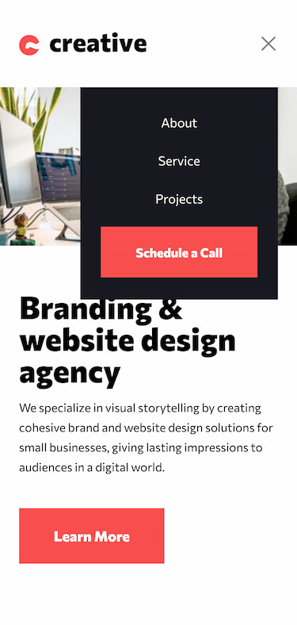
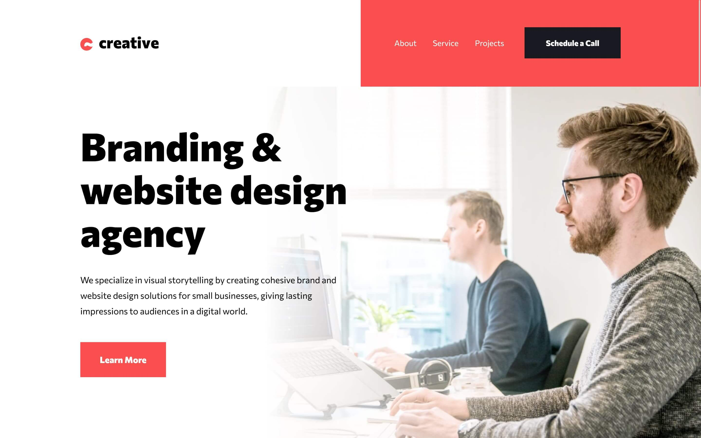

# Frontend Mentor - Creative agency single page site solution

This is a solution to the [Creative agency single page site challenge on Frontend Mentor](https://www.frontendmentor.io/challenges/creative-agency-singlepage-site-Pq6V3I2RM). Frontend Mentor challenges help you improve your coding skills by building realistic projects! 

## Table of contents

- [Overview](#overview)
  - [The challenge](#the-challenge)
  - [Screenshot](#screenshot)
  - [Links](#links)
- [My process](#my-process)
  - [Built with](#built-with)
  - [What I learned](#what-i-learned)
  - [Continued development](#continued-development)
  - [Useful resources](#useful-resources)
- [Author](#author)

## Overview

### The challenge

Users should be able to:

- View the optimal layout for the site depending on their device's screen size
- See hover states for all interactive elements on the page
- Navigate the slider using either their mouse/trackpad or keyboard

### Screenshot

- Solution in mobile 📱:



- Solution in desktop 💻:



### Links

- Solution URL: [Click here](https://www.frontendmentor.io/solutions/creative-single-page-site-using-tailwind-mPyJh9wh49)
- Live Site URL: [See live site here](https://juanbonilla.me/FEM_creative-single-page-site/)

## My process

### Built with

- Semantic HTML5 markup
- [Tailwind](https://tailwindcss.com/) - CSS framework
- Mobile-first workflow
- JavaScript

### What I learned

This project was good to try a few things that involved layout skills. Recently, I wanted to learn more about accessibility and here the idea of having different sections and a Carousel was enough for me to give it a try. So, I started adding some basic HTML structure and using Dev Tools as a guide to check where I needed to improve the accessibility tree. The Carousel was the most challenging section for me due to the interactions that it has. I add a part of my code below for you to see how the carousel was made and the importance of semantics supported with aria attributes:

```html
<div id="carousel" aria-live="polite" class="sm:absolute md:min-w-[27.375rem]">
  <div
    class="animate-opacity-100"
    role="group"
    aria-roledescription="slide"
    aria-label="1 of 3"
  >
    <figure class="relative">
      <picture>
        <source media="(min-width: 1024px)" srcset="./assets/desktop/image-slide-1.jpg">
        <source media="(min-width: 640px)" srcset="./assets/tablet/image-slide-1.jpg">
        
      </picture>

      <figcaption class="slide-caption">
        <strong class="font-extrabold lg:text-[1.25rem]">Lean Product Roadmap</strong>
        2019 Project
      </figcaption>
    </figure>
  </div>

        <!-- More slides -->
</div>
```

It is important to use `<div>`s because of the need of adding the `role="group"`. It helps assistive technologies to know which content is part of the slide. Moreover, if you were to use a `<ul>` you could introduce an issue since a Screen Reader will read it as a list of one item, in case you keep hidden the other slides. 

At the time of working with Tailwind, I wanted to know how to split common classes in a particular component and in that way, reduce the classes added into my HTML. I found out that this was possible using the components syntax. I will include this snippet in case you want to see how easy is to implement it:

```css
// Read more on https://tailwindcss.com/docs/reusing-styles#extracting-classes-with-apply
@layer components {
  .list-item {
    @apply relative pt-11 pl-4;
  }
}
```

Speaking of JavaScript, I had my first time implementing a closure. It was a good opportunity to use it since the use case appeared. I wanted to avoid adding complexity or rewriting code just to toggle the direction of my carousel when the user clicked any button (Next or Previous). Additionally, this closure helped me to extend the functionality for two event listeners (mouse down and key down). You can see below the implementation:

```js
// ... Code and variables declaration

const changeCarouselSlide = (direction) => {
    return () => {
        carousel.children[currentSlide].classList.add('hidden');
        carouselBrands.children[currentSlide].classList.add('hidden');

        if (currentSlide + direction < 0) {
            currentSlide = carouselLength - 1;
        } else if (currentSlide + direction >= carouselLength) {
            currentSlide = 0;
        } else {
            currentSlide += direction; 
        }

        carousel.children[currentSlide].classList.remove('hidden');
        carouselBrands.children[currentSlide].classList.remove('hidden');
    };
};

const previousSlide = changeCarouselSlide(-1);
const nextSlide = changeCarouselSlide(1);

previousButton.addEventListener('mousedown', previousSlide);
previousButton.addEventListener('keydown', (e) => buttonKeyDown(e, previousSlide, 'button'));

nextButton.addEventListener('mousedown', nextSlide);
nextButton.addEventListener('keydown', (e) => buttonKeyDown(e, nextSlide, 'button'));
```

### Continued development

This project was helpful to understand how Tailwind is used and how comfortable I felt while using it. This framework gives you the possibility of speeding up your project. However, I didn’t like to see the amount of classes added to the HTML just to apply different styles. I consider this is a good starting point to check other frameworks or tools to play with styles and decide what could be better depending on the use case.

Apart from that, I will continue caring for accessibility. I found this approach fun and interesting. I have been learning a lot of concepts and some attributes required in HTML to make it more accessible. Also, I have been using Screen reader and Dev Tools to check for issues so I can recognize a bit better how people with disabilities will navigate my site.


### Useful resources

- [What is PostCSS? How to Use Plugins to Automate CSS Tasks](https://www.freecodecamp.org/news/what-is-postcss/) - I wanted to know about what PostCSS is and why it could be a good option for styles.
- [Learn how to power-up your CSS with PostCSS](https://www.youtube.com/watch?v=ohJcZW60br0) - An excellent introduction to PostCSS, how to set it up, and the basics to get started quickly.
- [Get your stylesheets more organized with Sass partials](https://www.youtube.com/watch?v=9Ld-aOKsEDk) - In this video Kevin presents an amazing explanation on the importance of having a well-structured CSS folder to make it easy to find particular selectors or values used in our pages.
- [Tasty CSS-animated hamburgers](https://jonsuh.com/hamburgers/) - This site was a great inspiration at the time of creating my hamburger menu. You can take a look and see which one matches your style!
- [List style type - Decimal leading zero](https://stackoverflow.com/questions/22856682/change-ol-from-01-to-01) - This was useful to learn new properties available to style a ordered list with a easy to follow example.
- [Auto-Rotating Image Carousel Example with Buttons for Slide Control](https://www.w3.org/WAI/ARIA/apg/example-index/carousel/carousel-1-prev-next.html) - This is an amazing documentation to understand the creation of an accessible carousel. I wanted to go deeper into a11y features, roles, attributes and so on. This gave me valuable knowledge when writing meaningful HTML for visually impaired users.
- [How to build a more accessible carousel or slider ](https://dev.to/jasonwebb/how-to-build-a-more-accessible-carousel-or-slider-35lp) - This article is key to understand issues and elements involved at the time of adding a carousel in our project. You have here excellent examples to avoid creating a bad carousel and a good one with clear explanations.   
- [Inline elements shifting when made bold on hover](https://stackoverflow.com/questions/556153/inline-elements-shifting-when-made-bold-on-hover) - This forum answer was helpful when I wanted to apply hover styles to my text. I noticed that the font weight was causing a layout shift. If you want to solve the same problem easily, this resource will help you.

## Author

- Website - [juanbonilla.me](https://juanbonilla.me)
- Frontend Mentor - [@juanpb96](https://www.frontendmentor.io/profile/juanpb96)
- LinkedIn - [Juan Bonilla](https://www.linkedin.com/in/juan-pablo-bonilla-6b8730115/)